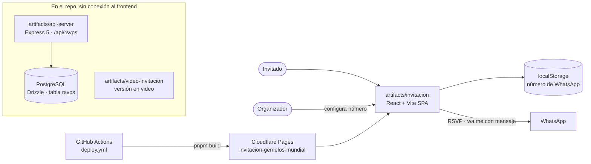

# Invitación Gemelos · Mundial ⚽

**Invitación digital de cumpleaños con temática del Mundial para Dulce y Tadeo**

[](https://github.com/FriskyDevelopments/invitacion-gemelos-mundial/actions/workflows/deploy.yml)    

Invitación web de cumpleaños con temática mundialista para los gemelos **Dulce y Tadeo**. La página principal (`artifacts/invitacion`) muestra un boleto de partido con la fecha, la hora y el lugar, además de una cuenta regresiva, confeti, una animación de gol y un formulario de confirmación (RSVP) que abre **WhatsApp** con un mensaje prellenado. El número de WhatsApp de destino lo guarda el organizador en el navegador (`localStorage`) desde el panel de configuración de la misma página. El monorepo nació en Replit e incluye también una versión en video de la invitación y una API Express + Postgres para guardar confirmaciones que **todavía no está conectada al frontend**. Está pensado para los invitados de la fiesta y para quien organiza.

## Arquitectura



## Stack

- pnpm workspaces · TypeScript
- React + Vite (invitación y versión en video), Tailwind CSS
- Express 5, Drizzle ORM y PostgreSQL (API de RSVPs), Zod, Orval (codegen desde OpenAPI)
- GitHub Actions → Cloudflare Pages

## Estructura del proyecto

```text
artifacts/
├── invitacion/        # invitación principal (la que se publica)
├── video-invitacion/  # versión en video por escenas
├── api-server/        # API Express: /api/healthz, /api/rsvps
└── mockup-sandbox/    # sandbox de maquetas de Replit
lib/
├── api-spec/          # openapi.yaml + configuración de Orval
├── api-zod/           # esquemas Zod generados
├── api-client-react/  # hooks React Query generados
└── db/                # esquema Drizzle (tabla rsvps)
scripts/               # utilidades del workspace
wrangler.toml          # salida de Pages: artifacts/invitacion/dist/public
```

## Desarrollo local

Requiere pnpm (el `preinstall` rechaza npm y yarn). No hay lockfile versionado.

```bash
# Instalar dependencias
pnpm install

# Invitación principal en modo desarrollo (Vite, puerto 5173 por defecto)
pnpm --filter @workspace/invitacion run dev

# Versión en video
pnpm --filter @workspace/video-invitacion run dev

# Typecheck + build de todos los paquetes
pnpm run build

# API (requiere PORT y DATABASE_URL)
pnpm --filter @workspace/api-server run dev

# Aplicar el esquema a Postgres (solo desarrollo)
pnpm --filter @workspace/db run push

# Regenerar hooks y esquemas desde openapi.yaml
pnpm --filter @workspace/api-spec run codegen
```

## Variables de entorno

Solo nombres; los valores nunca se versionan.

**Frontends (Vite)**

- `PORT`
- `BASE_PATH`

**API**

- `PORT`
- `DATABASE_URL`
- `LOG_LEVEL`
- `NODE_ENV`

**GitHub Actions (secrets)**

- `CLOUDFLARE_API_TOKEN`
- `CLOUDFLARE_ACCOUNT_ID`

## Despliegue

Cada push a `main` ejecuta `.github/workflows/deploy.yml`: instala con pnpm 9 en Node 20, corre `pnpm run build` y publica `artifacts/invitacion/dist/public` en el proyecto de **Cloudflare Pages** `invitacion-gemelos-mundial` con `cloudflare/pages-action`. Solo se publica la invitación estática. La API y la versión en video no tienen despliegue configurado.
